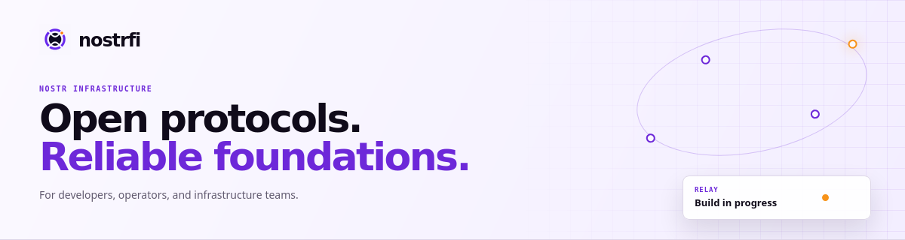

# Reliable foundations for people building on Nostr

Nostrfi builds dependable relay and backend infrastructure for client
developers, relay operators, and teams working with open networks.

[**Explore Nostrfi Relay →**](https://github.com/nostrfi/relay) ·
[View all repositories](https://github.com/orgs/nostrfi/repositories)

## What we build

### Nostrfi Relay · In development

[Nostrfi Relay](https://github.com/nostrfi/relay) is our first infrastructure
product. It is being developed as a reliable relay foundation for Nostr
clients, relay operators, and infrastructure teams.

The work covers the practical concerns involved in operating a Nostr relay:

- event ingest, storage, filtering, queries, and subscriptions;
- protocol compatibility and clear relay policy;
- deployment, observability, scaling, and reliability; and
- maintainable infrastructure that operators can understand and control.

## How we work

- **Open by design.** We favour interoperability and open choices over lock-in.
- **Clear about trade-offs.** We describe capabilities, limitations, policy,
  and maturity precisely.
- **Built to operate.** We treat storage, deployment, observability, and
  reliability as product concerns.

## Follow the work

Relay is actively being developed. Browse the
[source repository](https://github.com/nostrfi/relay) to review the current
implementation and follow its progress.
